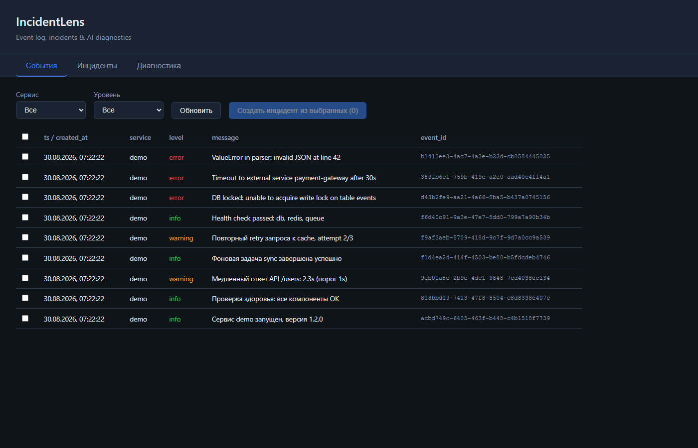
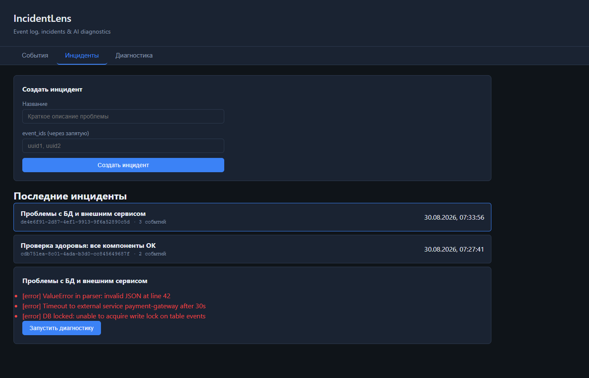
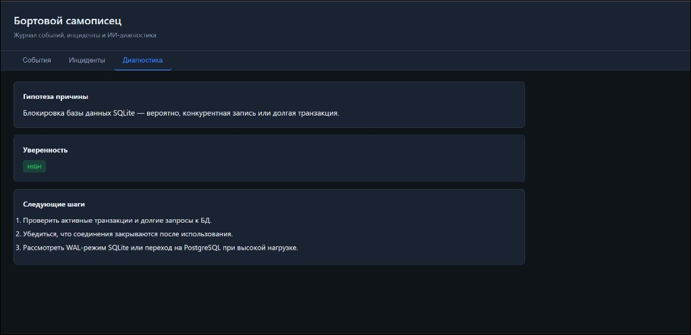

# IncidentLens


**IncidentLens** is a service flight recorder for small teams: capture scattered logs and errors, group them into incidents, and get structured AI diagnostics — root-cause hypothesis, confidence level, and next steps. When data is insufficient, the system honestly asks for manual review instead of guessing.

> Russian working title: *«Бортовой самописец»* — the black box that records what happened and helps you understand why.

Repository: [nifontovoleg/incident-lens](https://github.com/nifontovoleg/incident-lens)

Demo: [YouTube](https://youtu.be/spOQg0AX-nA)

---

## Why this exists

When something breaks in production, chaos starts fast:

- errors land in different places — console, log files, chat messages;
- there is no single timeline of *what happened* and *what was already tried*;
- "diagnostics" often becomes guesswork in a Slack thread with no evidence.

**IncidentLens** gives you one place to:

1. **Ingest events** (`info` / `warning` / `error`) into a searchable log
2. **Bundle related events** into a named incident
3. **Run AI diagnostics** that return strict JSON: hypothesis + confidence + actionable steps
4. **Flag low-confidence cases** and tell you exactly which logs and metrics to collect

---

## Screenshots

### Events dashboard

Filter by service and level, select events, create an incident in one click.



### Incidents

Create incidents from selected `event_id`s, browse the last 20, open details, launch diagnostics.



### AI diagnostics

Structured output: root-cause hypothesis, confidence badge, next steps. When `needs_review=true`, the UI highlights missing data.



---

## Features

| Feature | Description |
|---|---|
| **Event journal** | `POST /events` — ingest info / warning / error with service, message, optional timestamp |
| **Event showcase** | `GET /events?service=&level=` — filter and browse the full stream |
| **Incident grouping** | `POST /incidents` — link multiple events under one title |
| **AI diagnostics** | `POST /ai/diagnose` — strict JSON: `root_cause_hypothesis`, `confidence`, `next_steps`, `needs_review` |
| **Manual review gate** | `confidence=low` or sparse data → `needs_review=true` + "collect clarifications" as first step |
| **Full audit trail** | Every API call (including validation errors) logged to `audit_runs` |
| **Web panel** | 3 tabs — Events, Incidents, Diagnostics — dark UI, no framework overhead |
| **Seed data** | `tests_data/events.jsonl` — 10 sample events including one invalid row for validation testing |

---

## Architecture

```
External service / script / operator
              │
              ▼
        POST /events  ──►  events table
              │
              ▼
   Web panel (select events)
              │
              ▼
      POST /incidents  ──►  incidents + incident_events
              │
              ▼
     POST /ai/diagnose  ──►  diagnoses table
              │                (diagnosis_json as text)
              ▼
        audit_runs  ◄──  all API calls + errors
```

### Database (SQLite)

| Table | Purpose |
|---|---|
| `events` | What happened — `id`, `created_at`, `service`, `level`, `message`, `ts` |
| `incidents` | Named problems — `id`, `created_at`, `title` |
| `incident_events` | Many-to-many link incident ↔ events |
| `diagnoses` | AI output — `diagnosis_json`, `needs_review`, `error` |
| `audit_runs` | API audit — `action`, `input`, `output`, `status`, `error`, `duration_ms` |

---

## Project layout

```
incident-lens/
├── app/
│   ├── main.py                 # FastAPI app, lifespan, validation → audit
│   ├── config.py               # Settings (env prefix FR_)
│   ├── database.py             # SQLAlchemy engine + session
│   ├── models.py               # ORM models
│   ├── schemas.py              # Pydantic v2 request/response schemas
│   ├── audit.py                # Audit logging helper
│   ├── routers/
│   │   ├── events.py           # POST/GET /events
│   │   ├── incidents.py        # POST/GET /incidents
│   │   ├── ai.py               # POST /ai/diagnose
│   │   └── audit.py            # GET /audit/runs
│   ├── services/
│   │   └── diagnosis.py        # Heuristic AI diagnostics engine
│   └── static/                 # Web panel (HTML/CSS/JS)
├── docs/screenshots/           # README screenshots
├── tests/
│   └── test_api.py             # 11 integration tests
├── tests_data/
│   └── events.jsonl            # 10 sample events (1 invalid)
├── scripts/
│   └── seed_events.py          # Load sample data via API
├── requirements.txt
├── .gitignore
└── README.md
```

---

## Quick start

### 1. Clone and install

```bash
git clone https://github.com/nifontovoleg/incident-lens.git
cd incident-lens
python -m venv .venv

# Windows
.venv\Scripts\activate
# Linux / macOS
source .venv/bin/activate

pip install -r requirements.txt
```

### 2. Run the server

```bash
uvicorn app.main:app --reload
```

| URL | Purpose |
|---|---|
| http://127.0.0.1:8000 | Web panel |
| http://127.0.0.1:8000/docs | Swagger UI |
| http://127.0.0.1:8000/health | Health check |

### 3. Load sample events

```bash
python scripts/seed_events.py
```

Expected: **9 accepted**, **1 rejected** (invalid `level` + empty `message` in line 10 of `events.jsonl`). The failed attempt is still recorded in `audit_runs`.

### 4. Run tests

```bash
pytest tests/ -v
```

---

## API reference

### `POST /events` — add event

```json
{
  "service": "demo",
  "level": "error",
  "message": "DB locked: unable to acquire write lock",
  "ts": null
}
```

Response `201`:

```json
{ "status": "ok", "event_id": "uuid" }
```

Errors: `422` on invalid `level` or empty `message`.

### `GET /events` — list events

Query params: `?service=demo&level=error`

### `POST /incidents` — create incident

```json
{
  "title": "DB and external service issues",
  "event_ids": ["uuid-1", "uuid-2"]
}
```

Errors: `404` if any `event_id` is missing.

### `POST /ai/diagnose` — run diagnostics

```json
{
  "title": "DB issues",
  "messages": ["DB locked: unable to acquire write lock"],
  "incident_id": "uuid"
}
```

Response (strict JSON):

```json
{
  "root_cause_hypothesis": "SQLite database lock — likely concurrent write or long transaction.",
  "confidence": "high",
  "next_steps": [
    "Check active transactions and long-running queries.",
    "Ensure connections are closed after use.",
    "Consider SQLite WAL mode or PostgreSQL under high load."
  ],
  "needs_review": false
}
```

**Manual review triggers:**

- `confidence = "low"`
- too few or too vague messages

In those cases: `needs_review = true` and `next_steps[0]` starts with collecting clarifications (logs, metrics, stack traces).

### `GET /audit/runs` — audit history

Returns the last API calls with `action`, `input`, `output`, `status`, `error`, `duration_ms`.

---

## User workflows

### Workflow 1 — Events showcase

1. Open the **Events** tab
2. Filter by `service` and `level`
3. Spot errors and warnings in one table

### Workflow 2 — Build an incident

1. Check the related events
2. Click **Create incident from selected**
3. Enter a title on the **Incidents** tab
4. Open the incident to see linked events

### Workflow 3 — Run diagnostics

1. Open an incident
2. Click **Run diagnostics**
3. Switch to the **Diagnostics** tab
4. Read hypothesis, confidence, and next steps
5. If **requires review** — follow the "missing data" block

### Practice: trigger manual review

Create an incident from vague messages like `"ошибка"` and `"сбой"`. Expected result:

```json
{
  "confidence": "low",
  "needs_review": true,
  "next_steps": ["Collect clarifications: ...", "..."]
}
```

---

## Configuration

Settings via `.env` with prefix `FR_`:

| Variable | Default | Description |
|---|---|---|
| `FR_DATABASE_URL` | `sqlite:///./flight_recorder.db` | Database connection URL |
| `FR_APP_TITLE` | `IncidentLens` | Application title |

---

## How to evolve this project

IncidentLens is intentionally small and production-shaped. Here is a realistic roadmap:

### Near term

| Direction | What to add |
|---|---|
| **Real LLM backend** | Swap `services/diagnosis.py` heuristics for OpenAI / local model with JSON mode and schema validation |
| **Webhook ingest** | `POST /events/batch` + HMAC signature for Sentry, Grafana, custom agents |
| **Incident status** | `open` / `investigating` / `resolved` + assignee field |
| **PostgreSQL** | Replace SQLite for multi-instance deploys; add Alembic migrations |
| **Docker** | `Dockerfile` + `docker-compose.yml` with healthchecks |

### Medium term

| Direction | What to add |
|---|---|
| **Alerting** | Notify Telegram / Slack when `error` events spike or `needs_review=true` |
| **Correlation** | Auto-group events by `trace_id`, `service`, time window |
| **Timeline view** | Visual incident timeline with event markers |
| **RBAC** | API keys per team, read-only vs operator roles |
| **Export** | PDF / Markdown incident report for postmortems |

### Long term

| Direction | What to add |
|---|---|
| **Multi-tenant SaaS** | Organizations, projects, per-tenant isolation |
| **RAG over runbooks** | Feed internal docs into diagnostics for company-specific steps |
| **Anomaly detection** | Baseline normal traffic, flag deviations before they become incidents |
| **Integrations** | Prometheus, Loki, Elasticsearch, PagerDuty, Jira |

The current architecture (routers → services → DB + audit) is designed so each layer can grow without a rewrite.

---

## Acceptance criteria

- [x] Events are ingested and visible in the showcase
- [x] Incidents can be created from selected events
- [x] Diagnostics return strict JSON and are persisted in `diagnoses`
- [x] `needs_review=true` example exists (sparse / vague data)
- [x] Audit log captures all runs including validation errors

---

## Tech stack

- **Python 3.11+**
- **FastAPI** — async-ready API with OpenAPI docs
- **Pydantic v2** — request validation at the boundary
- **SQLAlchemy 2.x** — ORM, SQLite by default
- **Vanilla JS** — web panel, no build step

---

## Author

**Oleg Nifontov** — Python backend, AI automation, Telegram bots

- GitHub: [@nifontovoleg](https://github.com/nifontovoleg)

---

## License

MIT
